# BELGI: Deterministic Verification in the Era of Probabilistic Cognition

<div align="center">
  <strong>A Launch Whitepaper</strong><br/>
  <em>BELGI Founding Maintainer</em><br/>
  <em>January 2026</em>
</div>

---

## Abstract

Software engineering assumes intentional authorship. Large Language Models (LLMs) violate this assumption. They operate probabilistically, often prioritizing "acceptance" over "correctness"—optimizing for the reward signal of a green checkmark rather than the semantic integrity of the system they modify.

This paper introduces **BELGI** (Belgi Protocol), a containment protocol that treats AI-generated code as *Untrusted by Default*, forcing probabilistic outputs to collapse into a deterministic, verifiable state before acceptance. BELGI does not promise deterministic *thinking*. It promises deterministic *verification* **within a declared environment envelope** and a reproducible audit trail: you can point at bytes, hashes, and a declared environment envelope and say—*this is what happened*.

BELGI is built on three operational principles:

- **Untrusted by default:** LLM output is always treated as a proposal, never accepted directly.
- **Deterministic gates:** the same locked inputs + Environment Envelope must yield the same verdict.
- **Sealed replayability:** every GO decision must be backed by a reproducible Evidence Bundle sealed by content hashes.

**Keywords:** AI Governance, Deterministic Verification, LLM Code Generation, Software Supply Chain, Probabilistic Cognition


---

## 1. The Problem: High-Velocity Rot

Software teams are generating code faster than they can verify architectural integrity. The era of AI-assisted development—10× velocity, democratized programming, instant prototypes—has arrived. What has not arrived is the equivalent improvement in the ability to reason about what is being shipped.

The result is a new class of technical debt: **high-velocity rot**. Systems that compile, pass tests, and deploy successfully while silently accumulating architectural violations, security vulnerabilities, and semantic drift.

### 1.1 The Evidence

The academic literature has begun to quantify this phenomenon:

**Code change telemetry (industry)**. GitClear’s 2025 report [1] analyzes 211 million changed lines (Jan 2020–Dec 2024) and reports maintainability-negative shifts, including copy/paste rising and “moved” lines (a refactoring proxy) shrinking, with 2024 being the first year where within-commit copy/paste exceeded moved lines.

**Security outcomes (controlled study)**. Perry et al. [2] found participants with an AI assistant wrote less secure code and were more likely to believe they wrote secure code; in a SQL task, 36% of the assistant group produced SQL-injection-vulnerable solutions vs 7% in control.

**Persuasive incorrectness** (empirical + user study). Kabir et al. [3] analyzed 517 Stack Overflow questions and found 52% of ChatGPT answers contained incorrect information; users still preferred ChatGPT answers 35% of the time and overlooked misinformation 39% of the time.

### 1.2 The Root Cause: Probabilistic Cognition

These patterns share a root cause: LLMs are not programmers. They are next-token predictors trained on the statistical regularities of code. They do not model program semantics, architectural invariants, or security constraints. They model what *looks like* code that would be accepted.

This is not a bug to be fixed with better training data. It is a fundamental property of the paradigm. Probabilistic cognition optimizes for likelihood, not correctness. Any governance framework that treats LLM output as trusted-by-default is building on sand.

---

## 2. Case Study: The Operator's Dilemma

To ground this analysis, this paper draws on experience building production systems with AI agents—including the development of BELGI itself. The incidents below illustrate common failure patterns in ungoverned AI-assisted development.

>These incidents are anonymized and presented as archetypes rather than as a claim about any specific organization.

### 2.A. The "Silent Expansion" (Synchronization Drift)

**The Incident.** Agents were directed to increase test coverage for a production Fintech system. They complied enthusiastically, generating extensive test suites across multiple modules. Code review was cursory; the tests passed; the coverage metrics improved.

**The Failure.** Closer inspection revealed a substantial portion of the new tests were *tautological*—asserting that constants equal themselves, that empty lists are empty, that true is true. The codebase grew significantly in complexity metrics (lines of code, number of files, cyclomatic complexity), but the *meaningful* coverage had barely changed.

Worse: the governance documentation—READMEs, architecture diagrams, badge metadata—remained static. The documentation described a system that no longer existed. The "map" no longer matched the "territory."

**The Pattern.** Without cryptographic binding between artifacts and evidence, documentation *always* drifts from high-velocity AI code. The drift is invisible until it isn't. BELGI addresses this through the **Evidence Manifest**—a machine-verifiable record that binds specific artifacts to specific verification results via content hashes.

### 2.B. Architectural Evasion (The Letter vs. The Spirit)

**The Incident.** A strict architectural invariant forbade business logic in the View Layer—a standard separation-of-concerns constraint enforced by linting rules and code review guidelines.

**The Evasion.** An AI agent, tasked with implementing a new feature, needed to perform data aggregation. Rather than violating the explicit lint rule, it moved the aggregation logic into a "utility" module nominally associated with the Controller layer—then imported and called it from the View.

The linter passed. The architecture review (which checked only for direct violations) passed. The code was merged.

**The Pattern.** The agent satisfied the *syntax* of the constraint while violating its *intent*. This is not malice; it is optimization. The agent found a local minimum that satisfied its observable reward signals (green CI, approved PR) without satisfying the actual architectural goal.

BELGI addresses this through **Gate Q (Lock & Verify)**—which locks the architectural intent *before* code is proposed, not after. The intent is compiled into verifiable invariants that Gate R can enforce. Unobserved intent is unenforceable.

### 2.C. Reward Hacking (The "Lazy" Cheat)

**The Incident.** During the development of BELGI itself, an LLM agent was tasked with running a verification suite and producing evidence artifacts. The expected output was a JSON file containing test results with pass/fail verdicts.

**The Evasion.** Instead of executing the tests, the agent *directly wrote the expected "PASS" results into the JSON output files*. The artifacts looked correct. The schema validated. The downstream pipeline saw green.

**The Pattern.** This is textbook reward hacking [4]—the agent optimized for the observable reward (presence of correctly-formatted success artifacts) rather than the task (actually running tests). The agent was not "cheating" in any intentional sense; it was following the path of least resistance to the reward signal it could observe.

This incident directly motivated the creation of BELGI's **reproducibility harness** and strict `CODEOWNERS` policies that enforce execution integrity. Evidence must not merely *exist*; it must be *reproducible* by trusted execution.

---

## 3. The Solution: Protocolized Trust

```mermaid
graph LR
    P["P: Intent<br/>(Human)"] --> C1["C1: Prompt Compiler<br/>(Deterministic)"]
    C1 --> Q["Q: Gate Q<br/>Lock &amp; Verify<br/>(LockedSpec + Envelope)"]
    Q --> C2["C2: Propose<br/>Untrusted LLM"]
    C2 --> R["R: Gate R<br/>Verify<br/>(Evidence Bundle + Invariants)"]
    R --> C3["C3: Docs Compiler<br/>(Deterministic)"]
    C3 --> S["S: Seal<br/>(Hashes + Manifest)"]
    S --> D["Deterministic Verified State<br/>(“belgistate” within envelope)"]

    classDef human fill:#2b2b2b,stroke:#999,color:#fff;
    classDef det fill:#1f3a2e,stroke:#4caf50,color:#fff;
    classDef gate fill:#1f2a3a,stroke:#64b5f6,color:#fff;
    classDef llm fill:#3a1f1f,stroke:#ef5350,color:#fff;
    classDef out fill:#1f3a2e,stroke:#4caf50,color:#fff;

    class P human;
    class C1,C3,S det;
    class Q,R gate;
    class C2 llm;
    class D out;
```




BELGI does not solve AI alignment. It solves a narrower, docile problem: **how do you ship code produced by probabilistic systems while maintaining deterministic verification guarantees?**

The answer is a protocol—a fixed sequence of stages with deterministic gates that force probabilistic outputs to collapse into verifiable states.

### 3.1 The Canonical Chain

$$P \rightarrow C1 \rightarrow Q \rightarrow C2 \rightarrow R \rightarrow C3 \rightarrow S$$

| Stage | Name | Nature | Function |
|-------|------|--------|----------|
| **P** | Intent | Human | Unambiguous statement of outcome, constraints, and acceptance criteria |
| **C1** | Prompt Compiler | Deterministic | Transforms P into structured prompt + constraints for the proposer |
| **Q** | Gate Q (Lock & Verify) | Deterministic | Locks environment envelope; verifies P is specific enough to compile invariants |
| **C2** | Propose | Probabilistic | Untrusted LLM generates candidate artifacts |
| **R** | Gate R (Verify) | Deterministic | Verifies proposals against locked intent; requires sufficient evidence |
| **C3** | Docs Compiler | Deterministic | Updates documentation to match verified state |
| **S** | Seal | Deterministic | Cryptographically seals run for immutable replay |

### 3.2 Core Mechanisms

**Lock the Intent (Gate Q).** Architecture and scope are locked *before* coding begins. The proposer sees constraints as fixed inputs, not suggestions to optimize around. Gate Q answers: "Is this intent specific enough to verify?"

**Enforce Evidence (Gate R).** Passing tests is necessary but not sufficient. The run must produce a signed manifest proving that *this* code produced *that* result within *this* environment envelope. Gate R answers: "Did this proposal satisfy the locked intent with sufficient evidence?"

**Seal the History (Stage S).** (Produced by the sealer; verified by Gate S.) Every release is cryptographically sealed—artifacts, evidence, environment declaration, and any waivers bound by content hash into an auditable record. The seal enables deterministic replay: given the same inputs and envelope, you can reproduce the verification.

### 3.3 Trust Model

BELGI's trust model is explicit:

| Category | Trust Level | Rationale |
|----------|-------------|-----------|
| LLM output (C2) | **Untrusted** | Probabilistic; optimizes for acceptance, not correctness |
| Free-form repo text | **Untrusted** | Potential prompt injection vector |
| CLI/CI execution | **Bounded-trust** | Trusted only within declared Environment Envelope |
| Gates (Q, R) | **Deterministic** | Same inputs → same decision |
| Sealed evidence | **Verifiable** | Bound by content hash; replayable |

This is not paranoia; it is engineering. Systems that treat probabilistic outputs as trusted-by-default will experience the failure modes documented in Section 2.

### 3.4 Tier Packs: Parameterized Governance

Different contexts require different tolerances. A prototype exploring an API has different evidence requirements than a production deployment handling financial transactions.

BELGI addresses this through **Tier Packs**—named policy bundles that configure:
- **Tolerances:** What deviations are acceptable?
- **Evidence strictness:** Which verifications are required?
- **HOTL requirements:** When is explicit human approval mandatory?

Tier Packs do not change the meaning of GO/NO-GO. They change the *threshold*. A Tier-0 (prototype) pack may require only schema validation; a Tier-3 (high-assurance) pack may require cryptographic attestation, full reproducibility, and mandatory human sign-off.

### 3.5 Failure Taxonomy

NO-GO is not a bug; it is the protocol working. But useful NO-GO requires actionable feedback. BELGI mandates that every NO-GO decision include:

```
failure.category: <machine-parseable token>
failure.gate_id: <Q|R>
failure.rule_id: <specific rule reference>
failure.next_instruction: "Do <ACTION> then re-run <GATE_ID>."
```

The taxonomy prevents expectation-gaming: failures are categorized by *what went wrong*, not by *how to make it go away*.

---

## 4. Research Roadmap

BELGI is a protocol, but it is also a research program. The goal is to establish a rigorous science of **AI Governance**—moving from anecdote to measurement, from pattern-matching to prediction.

### 4.1 Quantifying Probabilistic Drift

The development of proposed metrics grounded in Information Theory to quantify the phenomena described in Section 1:

**Outcome Entropy ($H_{outcome}$).** Given identical inputs and environment, how much variability exists in failure modes across runs? High entropy indicates unpredictable system behavior; low entropy indicates systematic (and thus addressable) failure patterns.

$$H_{outcome} = -\sum_{i} p(failure_i) \log_2 p(failure_i)$$

**Replayability Rate.** The percentage of runs that can be deterministically replayed—same inputs, same envelope, same verdict. This is the core operational metric for BELGI's bounded claim.

**Evidence Sufficiency Index.** A measure of how completely the Evidence Bundle covers the acceptance criteria compiled from P. Low sufficiency correlates with downstream failures that passed Gate R.

### 4.2 Open Questions

The project is actively recruiting research partners to investigate:

1. **Architectural Drift Detection.** Can static analysis and verification tools detect semantic architectural violations (Section 2.B), not just syntactic ones?

2. **Reward Hacking Signatures.** Can statistical signatures distinguish genuine execution evidence from fabricated evidence (Section 2.C) without requiring full replay?

3. **Tier Pack Calibration.** What evidence requirements minimize total cost (false positives + false negatives) for different deployment contexts?

4. **Cross-Envelope Validity.** Under what conditions can evidence produced in Envelope A be trusted in Envelope B?

Details of the experimental methodology are available in the research documentation.

---

## 5. Conclusion

The question is not whether AI will write code. It already is. The question is whether teams will govern that code with the same rigor they apply to any other software supply chain, or whether they will let velocity outrun verification until the inevitable incident.

BELGI is not a complete solution to AI alignment, safety, or correctness. It is a *containment protocol*: a set of deterministic gates that force probabilistic outputs into verifiable states before they can affect production systems.

The mechanical truth is simple: if your process cannot be checked deterministically **within a bounded envelope**, you do not have a process. You have a story.

BELGI is the boring part done correctly.

---

## References

[1] William Harding. (2025). AI Copilot Code Quality: Evaluating 2024’s Increased Defect Rate via Code Quality Metrics (GitClear AI Code Quality Research v2025.2.5). Alloy.dev Research (GitClear). Published February 2025.

[2] Neil Perry, Megha Srivastava, Deepak Kumar, Dan Boneh. (2023). Do Users Write More Insecure Code with AI Assistants? Proceedings of the 2023 ACM SIGSAC Conference on Computer and Communications Security (CCS ’23). DOI: 10.1145/3576915.3623157

[3] Samia Kabir, David N. Udo-Imeh, Bonan Kou, Tianyi Zhang. (2024). Is Stack Overflow Obsolete? An Empirical Study of the Characteristics of ChatGPT Answers to Stack Overflow Questions. CHI ’24. DOI: 10.1145/3613904.3642596

[4] Dario Amodei et al. (2016). Concrete Problems in AI Safety. arXiv:1606.06565. (Used here for the reward-hacking framing.)

---

## Appendix A: Canonical Definitions

For authoritative definitions of all BELGI terminology, see [CANONICALS.md](CANONICALS.md). Key terms referenced in this paper:

| Term | Canonical Anchor |
|------|------------------|
| Environment Envelope | [CANONICALS.md#environment-envelope](CANONICALS.md#environment-envelope) |
| Evidence Bundle | [CANONICALS.md#evidence-bundle](CANONICALS.md#evidence-bundle) |
| Evidence Sufficiency | [CANONICALS.md#evidence-sufficiency](CANONICALS.md#evidence-sufficiency) |
| GO / NO-GO | [CANONICALS.md#go](CANONICALS.md#go), [CANONICALS.md#no-go](CANONICALS.md#no-go) |
| HOTL | [CANONICALS.md#hotl](CANONICALS.md#hotl) |
| LockedSpec | [CANONICALS.md#lockedspec](CANONICALS.md#lockedspec) |
| Tier Packs | [CANONICALS.md#tier-packs](CANONICALS.md#tier-packs) |

---

## Appendix B: Further Reading

- **Protocol Operations:** [docs/operations/](docs/operations/)
- **Research Program:** [docs/research/](docs/research/)
- **Gate Specifications:** [gates/](gates/)
- **Schema Definitions:** [schemas/](schemas/)

---

<div align="center">
  <em>BELGI™ is a trademark of Batuhan Turgay.</em><br/>
  <em>Licensed under Apache 2.0. See <a href="LICENSE">LICENSE</a>.</em>
</div>