# Running BELGI (Local + CI)

DEFAULT: **NO-GO** unless an independent third party can replay the verification within the declared Environment Envelope using only the artifacts produced by this run.

This runbook is grounded in:
- Canonical chain and terms: `../../CANONICALS.md`
- Trust boundaries: `../../trust-model.md`
- Gate Q (Lock & Verify): `../../gates/GATE_Q.md`
- Gate R (Verify): `../../gates/GATE_R.md`
- Failure categories: `../../gates/failure-taxonomy.md`
- Tier defaults (canonical SSOT): `../../tiers/tier-packs.json`
  - Generated view (must match canonical): `../../tiers/tier-packs.md`
- Schemas: `../../schemas/*.schema.json` and `../../schemas/README.md`

Core intent contract (v1):
- IntentSpec template: `belgi/templates/IntentSpec.core.template.md`
- IntentSpec schema: `../../schemas/IntentSpec.schema.json`

## 0) Inputs

### 0.1 IntentSpec (required input artifact)
Create `IntentSpec.core.md` from the core template (`belgi/templates/IntentSpec.core.template.md`) and place it at the **repo root** (alongside `CANONICALS.md`). (**NEW**, v1 hardening: canonical on-disk location)

Deterministic requirements (enforced by Gate Q):
- The file MUST contain exactly one fenced YAML block and only that block is machine-parsed.
- The parsed YAML MUST validate against `../../schemas/IntentSpec.schema.json`.

## 1) Pipeline (deterministic stage order)
This is the canonical stage order as executed by the protocol. A reference implementation SHOULD provide compilers for C1 and C3; regardless of implementation, the artifacts named below MUST exist and satisfy the referenced schemas/gate checks.

1) IntentSpec → `IntentSpec.core.md` (human-authored, schema-validated YAML block)
2) Prompt compiler (C1) → candidate `LockedSpec.json` (and supporting evidence)
3) Gate Q → locks/accepts the candidate `LockedSpec.json` (pre-LLM)

Reference runner (v1, canonical entrypoint):

```bash
python -m chain.gate_q_verify \
  --repo . \
  --protocol-pack belgi/_protocol_packs/v1 \
  --intent-spec IntentSpec.core.md \
  --locked-spec LockedSpec.json \
  --evidence-manifest EvidenceManifest.json \
  --out GateVerdict.Q.json
```

4) Proposer (C2) → proposed repo revision (untrusted output)
5) Gate R → verifies proposed revision + evidence against the locked contract
6) Docs compiler (C3) → docs evidence/logs (post-R; append-only)
7) Seal (S) → `SealManifest.json`

## 1A) Canonical Run Chain (exact commands)

The following commands are the canonical, repo-shipped entrypoints for the chain stages.

Notes:
- `wrapper/*` scripts exist as strict forwarders, but `chain/*` is the canonical invocation surface.
- Tier parameters are loaded from the **active protocol pack**, which contains `tiers/tier-packs.json`.
  - Use `--protocol-pack <repo-relative-pack-dir>` to point at a pack directory containing `ProtocolPackManifest.json`.

### Stage C1 — Compile IntentSpec → LockedSpec

```bash
python -m chain.compiler_c1_intent \
  --repo . \
  --protocol-pack belgi/_protocol_packs/v1 \
  --intent-spec IntentSpec.core.md \
  --out LockedSpec.json \
  --run-id run-001 \
  --repo-ref owner/repo \
  --prompt-bundle-out bundle/prompt_bundle.bin \
  --tolerances tol-001=bundle/tolerances/tol-001.json \
  --envelope-id env-001 \
  --envelope-description "Pinned toolchain for run" \
  --expected-runner windows-x64 \
  --toolchain-ref tc-001=bundle/toolchains/toolchain-001.json
```

### Stage Q — Verify/Lock

```bash
python -m chain.gate_q_verify --repo . --protocol-pack belgi/_protocol_packs/v1 --intent-spec IntentSpec.core.md --locked-spec LockedSpec.json --evidence-manifest EvidenceManifest.json --out GateVerdict.Q.json
```

### Stage C2 — Propose (untrusted)

This repo does not ship a canonical C2 proposer. C2 MUST produce a concrete revision (e.g., a commit) and the tier-required evidence artifacts to be indexed into the R-snapshot EvidenceManifest.

### Stage R — Verify proposed revision

```bash
python -m chain.gate_r_verify \
  --repo . \
  --protocol-pack belgi/_protocol_packs/v1 \
  --locked-spec LockedSpec.json \
  --gate-q-verdict GateVerdict.Q.json \
  --evidence-manifest EvidenceManifest.json \
  --evaluated-revision HEAD \
  --gate-verdict-out GateVerdict.R.json \
  --out policy/verify_report.json
```

### Stage C3 — Compile docs + final manifest (append-only)

```bash
python -m chain.compiler_c3_docs \
  --repo . \
  --protocol-pack belgi/_protocol_packs/v1 \
  --locked-spec LockedSpec.json \
  --gate-q-verdict GateVerdict.Q.json \
  --gate-r-verdict GateVerdict.R.json \
  --r-snapshot-manifest EvidenceManifest.json \
  --out-final-manifest EvidenceManifest.final.json \
  --out-log docs/docs_compilation_log.json \
  --out-docs docs/run_docs.md \
  --out-bundle-dir bundle \
  --out-bundle-root-sha docs/bundle_root.sha256 \
  --profile public \
  --prompt-block-hashes prompt_block_hashes.json
```

### Stage S (producer) — Create SealManifest

```bash
python -m chain.seal_bundle \
  --repo . \
  --locked-spec LockedSpec.json \
  --gate-q-verdict GateVerdict.Q.json \
  --gate-r-verdict GateVerdict.R.json \
  --evidence-manifest EvidenceManifest.final.json \
  --replay-instructions replay_instructions.json \
  --final-commit-sha <FINAL_COMMIT_SHA> \
  --sealed-at 2000-01-01T00:30:00Z \
  --signer human:release-manager \
  --out SealManifest.json
```

Note (protocol pack pinning): sealing does not accept `--protocol-pack`; it deterministically binds already pack-evaluated artifacts (LockedSpec + gate verdicts + final EvidenceManifest) into the SealManifest.

### Gate S (verifier) — Verify SealManifest

```bash
python -m chain.gate_s_verify \
  --repo . \
  --locked-spec LockedSpec.json \
  --protocol-pack belgi/_protocol_packs/v1 \
  --seal-manifest SealManifest.json \
  --evidence-manifest EvidenceManifest.final.json \
  --out GateVerdict.S.json
```

## 1B) When to run what (DEV / PRE-MERGE / RELEASE)

DEV (tight loop):
- After any change to gates, chain logic, schemas, tiers, templates, or manuals: run `python -m tools.sweep consistency --repo .`
- After any change to Q/R logic or fixtures: run `python -m tools.sweep fixtures-qr --repo .`
- After any change to Seal/Gate S logic or fixtures: run `python -m tools.sweep fixtures-seal --repo .` and/or `python -m tools.sweep fixtures-s --repo .`

If the consistency sweep fails only on `CS-EV-006`, converge deterministically with:
- `python -m tools.sweep consistency --repo . --fix-fixtures`

If you see `REGEN-SEALS NO-GO` after `--fix-fixtures`, regenerate only the touched seal-related fixtures (then re-verify via Gate S) with:
- `python -m tools.sweep consistency --repo . --fix-fixtures --regen-seals`

PRE-MERGE (repo safety):
- Run `python -m tools.sweep consistency --repo .` (and fix any FAILs; do not waive)
- Run the relevant fixture sweeps for the areas touched (`fixtures-qr`, `fixtures-s`, `fixtures-seal`)

RELEASE / PACK (publish posture):
- Run `python -m tools.sweep consistency --repo .`
- Ensure all fixture sweeps are green and the builtin protocol pack is drift-clean

## 1) Overview: what happens in P → C1 → Q → C2 → R → C3 → S

Canonical chain: `P → C1 → Q → C2 → R → C3 → S` (see `../../CANONICALS.md`).

```mermaid
flowchart LR
  %% Styles
  classDef standard fill:#000000,stroke:#333,stroke-width:1px;
  classDef danger fill:#b71c1c,stroke:#b71c1c,stroke-width:2px;
  classDef safe fill:#2e7d32,stroke:#2e7d32,stroke-width:2px;
  classDef exec fill:#0d47a1,stroke:#0d47a1,stroke-width:2px;

  %% Main Pipeline
  subgraph Trusted_Pipeline [Deterministic Pipeline]
    direction LR
    P[P: Human Intent]:::standard --> C1[C1: Prompt Compiler]:::standard
    C1 --> Q{Q: Gate Q\nLock & Verify}:::safe
    Q --> |"Locked Spec"| R{R: Gate R\nVerify}:::safe
    R --> C3[C3: Docs Compiler]:::standard
    C3 --> S((S: Seal)):::safe
  end

  %% External & Sandbox
  subgraph Wild [Untrusted]
    LLM["C2: Propose (untrusted)"]:::danger
  end

  subgraph Box [Sandboxed Envelope]
    CI[CI / Execution]:::exec
  end

  %% Cross-graph connections
  Q -.-> |"Prompt"| LLM
  LLM -.-> |"Proposed Code"| R
  R <--> |"Verify Artifacts"| CI
```



Operational principle (canonical): **LLMs propose; gates dispose.**

## 2) Prerequisites

### 2.1 Repo state requirements (determinism prerequisites)
Gate Q requires `LockedSpec.upstream_state.dirty_flag == false` (see `../../schemas/LockedSpec.schema.json`).

Before running, ensure:
- You have a pinned upstream base revision (a concrete Git commit SHA).
- Working tree is clean (no uncommitted changes) so the upstream state can be locked.
- You can produce/retain all required run artifacts as schema-valid JSON (see schemas list below).

### 2.2 Environment Envelope expectations (bounded trust)
BELGI’s bounded claim is: “Deterministic validation of probabilistic execution within a declared environment envelope.” (see `../../CANONICALS.md#bounded-claim`).

**MUST be pinned (required by schema/gates):**
- `LockedSpec.environment_envelope.pinned_toolchain_refs[]` is required and must be non-empty (see `../../schemas/LockedSpec.schema.json`, check Q5 in `../../gates/GATE_Q.md`).
- The upstream base commit SHA (`LockedSpec.upstream_state.commit_sha`) must be a specific 40-hex SHA.

**MAY vary (but becomes outside the determinism boundary if it changes outcomes):**
- Anything not declared in `LockedSpec.environment_envelope` or not recorded as evidence.

**Bounded-trust envelope assumption (operator statement):**
- CLI/CI execution is trusted only insofar as it stays inside the declared envelope and produces reproducible evidence; anything outside is treated as untrusted (`../../CANONICALS.md#bounded-trust`).

### 2.3 doc_impact (operator requirement for Tier 2–3)
`doc_impact` is the LockedSpec field that declares whether documentation updates are required by the validated change set.

Rules (v1):
- Tier 2–3: `LockedSpec.doc_impact` MUST be present.
- `doc_impact.required_paths` MAY be empty `[]` to explicitly declare “no doc updates required.”
- If `required_paths` is `[]`, then `doc_impact.note_on_empty` MUST be present and non-empty (explicit justification).

What failures look like:
- Gate Q: `Q-DOC-002` (missing/invalid doc_impact for tiers that require it)
- Gate R: `R-DOC-001` (required docs declared but not changed)

## 3) Local Run: step-by-step

All steps below MUST:
- produce or reference schema-valid artifacts, and
- record required evidence kinds in an EvidenceManifest (`../../schemas/EvidenceManifest.schema.json`), and
- satisfy the relevant Gate Q (Q-INTENT-001, Q-INTENT-002, Q-INTENT-003, Q1–Q7, Q-DOC-001, Q-DOC-002) and Gate R (R1–R8, R-DOC-001) checks.

### Step 0 — Choose a Tier Pack

**Goal:** pick the tier that sets evidence strictness and enforcement defaults.

- Inputs:
  - Human selection of `LockedSpec.tier.tier_id` (must be one of `tier-0`..`tier-3`; see Q7 in `../../gates/GATE_Q.md` and `../../tiers/tier-packs.json`).
- Outputs (schema artifacts):
  - (Embedded into) `LockedSpec.json` (`../../schemas/LockedSpec.schema.json`), including:
    - `tier.tier_id`, `tier.tier_name`, `tier.tolerances_ref`.
- Evidence kinds to record (in `EvidenceManifest.artifacts[].kind`):
  - `policy_report` (tier selection rationale at a category level; no bypass details).
- Gate checks satisfied:
  - Gate Q: Q7 (Tier ID supported)

Failure handling:
- If Gate Q returns `FQ-TIER-UNKNOWN`, amend tier selection and re-run Gate Q.

### Step 1 — Write IntentSpec (core intent contract)

**Goal:** ensure intent is machine-parseable and deterministically compilable into LockedSpec.

- Inputs:
  - Human-authored `IntentSpec.core.md` created from `belgi/templates/IntentSpec.core.template.md`.
  - The file MUST contain exactly one fenced YAML block; only that YAML block is machine-parsed.
- Outputs (schema artifacts):
  - Parsed core intent object validated against `../../schemas/IntentSpec.schema.json`.
  - (Later embedded into) `LockedSpec.json` (`../../schemas/LockedSpec.schema.json`) via deterministic compilation rules (see Gate Q `Q-INTENT-003`).
- Evidence kinds to record:
  - `policy_report` (category-level summary of intent compilation inputs/outputs; see Gate Q output requirements in `../../gates/GATE_Q.md`).
- Gate checks satisfied:
  - Gate Q: Q-INTENT-001 (YAML block parseable), Q-INTENT-002 (IntentSpec schema validation), Q-INTENT-003 (deterministic mapping)

Failure handling:
- Common deterministic failures:
  - multiple or missing ```yaml blocks (Q-INTENT-001)
  - missing required fields (Q-INTENT-002)
  - wildcard or non-normalized paths (Q-INTENT-002)
  - `doc_impact.required_paths: []` with missing/empty `doc_impact.note_on_empty` (Q-INTENT-002 and/or Q-DOC-002)
  - compiled LockedSpec fields not matching IntentSpec mapping rules (Q-INTENT-003)

### Step 2 — Compile candidate LockedSpec (C1) and run Gate Q

**Goal:** deterministically lock the run contract and reject unverifiable runs *before* proposing.

- Inputs:
  - P Intent (Step 1)
  - Tier selection (Step 0)
  - Environment envelope declaration (must include `pinned_toolchain_refs[]`)
  - Any human-authored waivers referenced by the candidate LockedSpec (optional)
- Outputs (schema artifacts):
  - Candidate `LockedSpec.json` (validates against `../../schemas/LockedSpec.schema.json`)
  - `GateVerdict.json` with `gate_id == "Q"` (validates against `../../schemas/GateVerdict.schema.json`)
  - Q-Snapshot `EvidenceManifest.json` (validates against `../../schemas/EvidenceManifest.schema.json`, and is referenced by `GateVerdict.evidence_manifest_ref`)
- Evidence kinds to record (minimum required at Q; see `../../gates/GATE_Q.md`):
  - `command_log` (C1 compilation/validation transcript)
  - `policy_report` (category-level compilation outputs)
  - `schema_validation` (schema validation outputs for LockedSpec and any waiver docs)
- Gate checks satisfied:
  - Gate Q: Q-INTENT-001, Q-INTENT-002, Q-INTENT-003, Q1–Q7, Q-DOC-001, Q-DOC-002

Failure handling:
- If `GateVerdict.verdict == "NO-GO"`:
  - Consult `GateVerdict.failures[]` and `GateVerdict.remediation.next_instruction`.
  - Perform exactly the remediation action and **re-run Gate Q** (remediation string must end with `then re-run Q.`).

### Step 3 — Run proposer (C2) in tool-restricted mode

**Goal:** produce candidate changes without granting authority to bypass gates.

Trust model alignment (see `../../trust-model.md`): C2 is **untrusted by default**.

Constraints for C2 (process-level; no implementation details):
- C2 MUST be bound to the locked run contract (the locked `LockedSpec.json`).
- C2 MUST NOT edit canonicals, gates, schemas, or other forbidden paths as constrained by `LockedSpec.constraints.*`.
- C2 MUST NOT create/approve/extend/revoke/edit waivers (see `waivers.md`).

- Inputs:
  - Locked `LockedSpec.json` (from Step 2)
- Outputs (schema artifacts):
  - Updated repository state (must be representable as a concrete revision that can be diffed against `LockedSpec.upstream_state.commit_sha`; see Gate R inputs in `../../gates/GATE_R.md`).
  - Evidence indexed in an EvidenceManifest snapshot suitable for Gate R input (the R-Snapshot EvidenceManifest referenced by `GateVerdict (R).evidence_manifest_ref`).
- Evidence kinds to record (tier-dependent, but commonly includes):
  - `diff` (post-proposal diff artifact)
  - `command_log` (commands executed by C2 or execution environment to generate evidence; shape is tier-dependent)
- Gate checks satisfied:
  - Gate R: R2 (scope budgets uses diff), R3 (path constraints uses diff)

Failure handling:
- If the diff violates constraints, do not “argue” with the gates; reduce scope or change the proposal, then proceed to Gate R.

### Step 4 — Run Gate R (verify)

**Goal:** deterministically verify the proposed repo state and evidence sufficiency.

- Inputs:
  - Locked `LockedSpec.json`
  - R-Snapshot `EvidenceManifest.json` (the EvidenceManifest object that will be referenced by `GateVerdict (R).evidence_manifest_ref`)
  - Proposed repo revision (commit SHA or equivalent concrete revision)
  - Waiver documents if `LockedSpec.waivers_applied[]` is present
- Outputs (schema artifacts):
  - `GateVerdict.json` with `gate_id == "R"` (validates against `../../schemas/GateVerdict.schema.json`)

Deterministic verifier (MUST-level enforcement):
- Run the canonical verifier and write a deterministic JSON report:
  - `python -m chain.gate_r_verify --repo . --protocol-pack belgi/_protocol_packs/v1 --locked-spec LockedSpec.json --gate-q-verdict GateVerdict.Q.json --evidence-manifest EvidenceManifest.json --evaluated-revision HEAD --gate-verdict-out GateVerdict.R.json --out policy/verify_report.json`
  - If you need to validate an existing GateVerdict input (defense-in-depth), pass it via `--gate-verdict <path>`.

Verifier ordered-results contract (hardening note):
- `chain/gate_r_verify.py` MUST emit an ordered `results[]` list in its report.
- “Ordered” means: the array order is the execution order from `chain/logic/r_checks/registry.py` and is the canonical source of truth for primary-cause selection.
- Primary cause is defined as the **first FAIL** entry in that ordered `results[]` list.
- Any tooling that enforces primary-cause selection across fixtures (e.g., `tools/sweep.py fixtures-qr`) MUST **FAIL closed** if the verifier output lacks an ordered `results[]` list.

Chain of custody note (R-Snapshot):
- Gate R’s verdict references its EvidenceManifest by ObjectRef hash (`GateVerdict.evidence_manifest_ref`). Therefore, the EvidenceManifest used for Gate R MUST be treated as immutable after R evaluation.
- Any evidence produced after R (e.g., C3 docs evidence) MUST be recorded in a Final EvidenceManifest that is an append-only extension of the R-Snapshot (see `evidence-bundles.md`).
- Evidence kinds to record (must be present in `EvidenceManifest.artifacts[].kind` as required by tier):
  - Tier 0 requires: `diff`, `command_log`, `schema_validation`, `policy_report`
  - Tier 1–3 require: `diff`, `command_log`, `schema_validation`, `policy_report`, `test_report`, `env_attestation`
  - Tier 3 additionally requires: `genesis_seal`
  - (From `../../tiers/tier-packs.json`: `docs_compilation_log` exists but is produced after Gate R (C3). Gate R MUST NOT require it.)
- Gate checks satisfied:
  - Gate R: R1–R8, R-DOC-001
  - Additionally, Gate R enforces Evidence Sufficiency (rule_id `R0.evidence_sufficiency`) and `command_log_mode` (rule_id `R0.command_log_mode`) per `../../gates/GATE_R.md`.

Failure handling:
- If `GateVerdict.verdict == "NO-GO"`:
  - Read `GateVerdict.failures[]` for the failing `rule_id` and category.
  - Follow `GateVerdict.remediation.next_instruction` exactly; it must end with `then re-run R.`.
  - Only re-run Gate Q if the failure requires changing the locked contract (e.g., intent, envelope, tier, constraints, waivers).

### Step 4b — Generate AuditReport (optional, post-R)

**Goal:** produce a deterministic human-readable summary (`AuditReport.md`) from the run artifacts, with a companion sha256 manifest so manual edits are detectable.

Notes:
- This is an operator convenience tool and is **not** a gate requirement.
- For Tier 3, the report includes an explicit YAML frontmatter block with the genesis insignia, sourced from the `genesis_seal` evidence artifact.

Run (example):

```bash
python -m tools.report \
  --repo . \
  --locked-spec LockedSpec.json \
  --evidence-manifest EvidenceManifest.json \
  --verify-report policy/verify_report.json \
  --gate-q-verdict GateVerdict.Q.json \
  --gate-r-verdict GateVerdict.R.json \
  --seal-manifest SealManifest.json
```

Integrity check (sha256sum-style manifest):

```bash
python -m tools.rehash sha256-txt --repo . --manifest AuditReport.sha256.txt --check
```

### Step 5 — Compile docs (C3)

**Goal:** produce deterministic documentation artifacts from the verified state.

- Inputs:
  - Verified repo state (post-R GO)
  - Locked `LockedSpec.json`
  - Gate verdicts (Q and R)
  - R-Snapshot `EvidenceManifest.json`
- Outputs (schema artifacts):
  - Final `EvidenceManifest.json` that is an append-only extension of the R-Snapshot EvidenceManifest (see `evidence-bundles.md`).
  - Exactly one evidence artifact recorded in the Final EvidenceManifest:
    - `kind: "docs_compilation_log"`, `produced_by: "C3"` (see `../../schemas/EvidenceManifest.schema.json`).
    - Bundle outputs are referenced inside the docs compilation log payload (`outputs`); they are not indexed as separate EvidenceManifest artifacts.
- Evidence kinds to record:
  - `docs_compilation_log` (C3)
  - `command_log` (C3)
- Gate checks satisfied:
  - None directly; this is post-verification. It supports replay and sealing.

Failure handling:
- If docs compilation fails, treat as NO-GO for progression to sealing; fix deterministically and re-run C3.

### Step 6 — Seal (S)

**Goal:** bind the run outputs into a sealed, auditable record for replay.

- Inputs:
  - `LockedSpec.json`
  - Gate verdicts: Q and R (`GateVerdict.json`)
  - Final `EvidenceManifest.json` (append-only extension of the R-Snapshot)
  - Any waiver documents used
  - Final repo commit SHA to seal
- Outputs (schema artifacts):
  - `SealManifest.json` (validates against `../../schemas/SealManifest.schema.json`)
- Evidence kinds to record:
  - `schema_validation` (SealManifest schema validation)
  - `command_log` (sealing command record)
- Gate checks satisfied:
  - None directly; sealing is the canonical terminal step (`../../CANONICALS.md#s-seal`).

Failure handling:
- If you cannot produce a schema-valid SealManifest with correct ObjectRefs/hashes, treat as NO-GO for publishing.

Audit-grade replay note:
- Audit-Grade replay requires cryptographic Seal verification per `evidence-bundles.md`.

## 4) CI Run (generic “GitHub Actions style”)

This section is tool-agnostic; command names shown are **EXAMPLE COMMAND (non-normative)**.

### 4.1 Recommended jobs
- `gate_q`: run C1 compilation + Gate Q. Produces: `LockedSpec.json`, `GateVerdict.json (Q)`, and the EvidenceManifest snapshot referenced by the Gate Q verdict.
- `propose`: run C2 proposer in restricted mode. Produces: candidate repo revision and additional evidence artifacts to be indexed into the R-Snapshot EvidenceManifest.
- `gate_r`: run Gate R. Produces: `GateVerdict.json (R)`.
- `docs_compile`: run C3 docs compiler. Produces: docs compilation evidence artifacts (`docs_compilation_log`).
- `seal`: produce `SealManifest.json`.

### 4.2 Artifact upload/download strategy (ObjectRef + storage_ref conventions)

Schemas require ObjectRef fields (`id`, `hash`, `storage_ref`) and SHA-256 hashes (see `../../schemas/README.md`).

Guidelines:
- Treat CI artifact storage as the backing store for `storage_ref`.
- Use stable, unique `id` values per artifact.
- Record the SHA-256 digest of the exact bytes stored.
- `storage_ref` MUST be a local, repo/bundle-relative POSIX path (using `/` separators) suitable for deterministic replay.
  - Example (non-normative): `evidence/manifests/<id>.json`

### 4.3 EvidenceManifest + SealManifest in CI

- Persist the **R-Snapshot EvidenceManifest** used by Gate R as a first-class CI artifact and carry it across jobs unchanged.
- If C3 produces additional evidence, write a **Final EvidenceManifest** as an append-only extension of the R-Snapshot (do not rewrite the R-Snapshot).
- Persist both gate verdicts as CI artifacts.
- Produce and upload `SealManifest.json` only after Gate R returns GO.

## 5) NO-GO Handling

### 5.1 Interpreting GateVerdict.failures and remediation
- `GateVerdict.failures[]` provides:
  - `category` (must be a stable token; see `../../gates/failure-taxonomy.md`)
  - `rule_id` (e.g., `Q2`, `R5`, or a sub-rule token)
  - `evidence_refs[]` (ObjectRefs) pointing to supporting evidence.
- `GateVerdict.remediation.next_instruction` is a **machine-parseable directive** with fixed format (see `../../schemas/GateVerdict.schema.json` and `../../CANONICALS.md#failure-taxonomy-interface`).

### 5.2 What gets re-run (Q vs R)
- Re-run **Q** if remediation changes the locked contract: intent, invariants, constraints, tier selection, environment envelope, or waivers.
- Re-run **R** if remediation changes evidence or proposed state under the same LockedSpec.

## 6) Operator Checklist (strict)

- Tier selected (`tier-0`..`tier-3`) and recorded in `LockedSpec.json`.
- Intent is unambiguous and compiles to non-empty invariants and constraints.
- LockedSpec validates and has `dirty_flag: false`.
- Gate Q verdict is GO and references an EvidenceManifest.
- Proposer ran under LockedSpec constraints; no waiver actions by proposer.
- R-Snapshot EvidenceManifest contains all tier-required evidence kinds.
- Gate R verdict is GO.
- Fixture sweep (closure gate): `python -m tools.sweep fixtures-qr`.
- Docs compilation evidence recorded (C3).
- SealManifest produced, schema-valid, and references LockedSpec, both verdicts, EvidenceManifest, and waiver refs (if any).

R-Snapshot / Final EvidenceManifest integrity:
- Gate R verdict references the R-Snapshot EvidenceManifest (by ObjectRef hash) and that R-Snapshot is preserved unchanged.
- If a Final EvidenceManifest exists (post-C3), it is an append-only extension of the R-Snapshot and the Gate R verified artifacts remain present and unmodified (see `evidence-bundles.md`).

## Consistency Sweep

Checklist (must be mechanically checkable):
- Byte-normalize first (prevents avoidable hash churn): `python -m tools.normalize --repo . --check --tracked-only` (or `--fix` if it fails).
- Run the sweep: `python -m tools.sweep consistency --repo .`.
- CS-EV-006 bootstrap behavior is expected: a first-run FAIL can occur due to self-referential hash pinning. Converge deterministically with `python -m tools.sweep consistency --repo . --fix-fixtures`, which pins the hash printed as `SHA-256 (fixtures should declare)`.
- Every referenced schema name exists: `LockedSpec.schema.json`, `GateVerdict.schema.json`, `EvidenceManifest.schema.json`, `SealManifest.schema.json`, `Waiver.schema.json`.
- Every mentioned evidence kind exists in `EvidenceManifest.artifacts[].kind`: `diff`, `test_report`, `command_log`, `env_attestation`, `policy_report`, `schema_validation`, `docs_compilation_log`.
- Every referenced gate check_id exists:
  - Q: `Q1`–`Q7`
  - Q: `Q-DOC-001`, `Q-DOC-002`
  - R: `R1`–`R8`
  - R: `R-DOC-001`
- Waiver process explicitly blocks LLM actions (see `waivers.md`).
- Replay procedure is complete for a third party (see `evidence-bundles.md`).
