# BELGI Trust Model (Sprint 1)

## 0. Rule of Use (Canonical Pointer)
This file MUST NOT define or redefine canonical terms; it explains threat categories and trust boundaries using the canonical definitions in [CANONICALS.md](CANONICALS.md).

Example run identifier (docs/examples only): `bk_ycanary_7f3a9c2d`

## 1. Threat Model Categories (High-Level)
- Hallucination / drift: proposer outputs may be wrong, inconsistent, or silently change across runs.
- Prompt injection via repo text: untrusted repository content may attempt to steer proposals or alter constraints.
- Backdoor diffs: proposals may introduce subtle malicious or policy-violating changes.
- Supply chain / toolchain drift: dependencies, compilers, or build tools may change and invalidate prior evidence.
- Flaky tests / nondeterminism: verification signals may be unstable, producing false GO/NO-GO.

## 2. Trust Boundaries (Mermaid)

```mermaid
flowchart LR
    %% Styles
    classDef standard fill:#000000,stroke:#333,stroke-width:1px;
    classDef danger fill:#b71c1c,stroke:#b71c1c,stroke-width:2px;
    classDef safe fill:#2e7d32,stroke:#2e7d32,stroke-width:2px;
    classDef exec fill:#0d47a1,stroke:#0d47a1,stroke-width:2px;

    %% Main Pipeline
    subgraph Trusted_Pipeline [Deterministic Pipeline]
        direction LR
        P[P: Human Intent]:::standard --> C1[C1: Prompt Compiler]:::standard
        C1 --> Q{Q: Gate 1}:::safe
        Q --> |"Locked Spec"| R{R: Gate 2}:::safe
        R --> C3[C3: Docs Compiler]:::standard
        C3 --> S((S: Seal)):::safe
    end

    %% External & Sandbox
    subgraph Wild [Untrusted]
        LLM[C2: LLM Proposer]:::danger
    end

    subgraph Box [Sandboxed Envelope]
        CI[CI / Execution]:::exec
    end

    %% Cross-graph connections
    Q -.-> |"Prompt"| LLM
    LLM -.-> |"Proposed Code"| R
    R <--> |"Verify Artifacts"| CI
```

## 3. Threats → Mitigations → Residual Risk (Category-Level)
This table lists conceptual mitigations only; it MUST NOT include bypass-oriented rule details.

| Threat | Primary mitigations (category-level) | Residual risk |
|---|---|---|
| Hallucination / drift | Treat proposer as untrusted; enforce deterministic gates (Q, R); require Evidence Bundle ([CANONICALS.md#evidence-bundle](CANONICALS.md#evidence-bundle)) and Evidence Sufficiency ([CANONICALS.md#evidence-sufficiency](CANONICALS.md#evidence-sufficiency)) | False confidence if evidence is incomplete or mis-scoped |
| Prompt injection via repo text | Lock inputs via LockedSpec ([CANONICALS.md#lockedspec](CANONICALS.md#lockedspec)); minimize untrusted text as authoritative input; gate verifies invariants from P ([CANONICALS.md#p-intent](CANONICALS.md#p-intent)) | Injection may still influence proposal content; caught only if gates are comprehensive |
| Backdoor diffs | Blast Radius constraints ([CANONICALS.md#blast-radius](CANONICALS.md#blast-radius)); policy invariant checks; adversarial diff scan category (see R responsibilities in CANONICALS) | Novel backdoors may evade category checks; requires defense-in-depth |
| Supply chain / toolchain drift | Declared Environment Envelope ([CANONICALS.md#environment-envelope](CANONICALS.md#environment-envelope)); attestation that evidence came from inside envelope; detect supply chain changes impacting evidence validity | Drift can still occur inside an envelope if the envelope is underspecified |
| Flaky tests / nondeterminism | Deterministic verification requirements ([CANONICALS.md#deterministic-belgi](CANONICALS.md#deterministic-belgi)); rerun/replay expectations under same envelope; treat unstable evidence as insufficient | Some nondeterminism can remain; may require HOTL ([CANONICALS.md#hotl](CANONICALS.md#hotl)) decisions per Tier Pack ([CANONICALS.md#tier-packs](CANONICALS.md#tier-packs)) |

## 4. Envelope Assumptions (Conceptual)
Within BELGI’s bounded claim, the declared Environment Envelope (Canonical definition: [CANONICALS.md#environment-envelope](CANONICALS.md#environment-envelope)) can express (conceptually):
- Pinned tool versions and lockfiles (or equivalent pinned dependency state).
- Container digest (or equivalent immutable build environment identifier) where applicable.
- An allowlist of permissible commands for evidence generation (conceptual; not an implementation signature list).
- Replay expectations: the same LockedSpec (Canonical definition: [CANONICALS.md#lockedspec](CANONICALS.md#lockedspec)) and envelope reproduce materially equivalent evidence.

## 5. Trust Assumptions (Canonical Alignment)
- Untrusted by default: all proposer outputs and any non-locked repo text used as inputs.
- Bounded-trust: CLI/CI execution only inside the declared Environment Envelope (Canonical definition: [CANONICALS.md#environment-envelope](CANONICALS.md#environment-envelope)).
- Deterministic: the gate decisions and compiler outputs are stable given the same LockedSpec (Canonical definition: [CANONICALS.md#lockedspec](CANONICALS.md#lockedspec)).

## 6. Canonical Pointers (No Definitions)

Deterministic (BELGI sense). Canonical definition: [CANONICALS.md#deterministic-belgi](CANONICALS.md#deterministic-belgi). Operational note (non-normative): determinism is scoped to the locked inputs and the declared Environment Envelope.

Bounded Trust. Canonical definition: [CANONICALS.md#bounded-trust](CANONICALS.md#bounded-trust). Operational note (non-normative): CLI/CI outputs become evidence only when collected and evaluated under gate rules within the locked envelope.

Environment Envelope. Canonical definition: [CANONICALS.md#environment-envelope](CANONICALS.md#environment-envelope). Operational note (non-normative): evidence outside the declared envelope is treated as unverified.

Evidence Bundle. Canonical definition: [CANONICALS.md#evidence-bundle](CANONICALS.md#evidence-bundle). Operational note (non-normative): the required contents vary by Tier Pack.

Evidence Sufficiency. Canonical definition: [CANONICALS.md#evidence-sufficiency](CANONICALS.md#evidence-sufficiency). Operational note (non-normative): when sufficiency cannot be established, the run outcome is NO-GO.

LockedSpec. Canonical definition: [CANONICALS.md#lockedspec](CANONICALS.md#lockedspec). Operational note (non-normative): proposals are judged against a stable contract.
